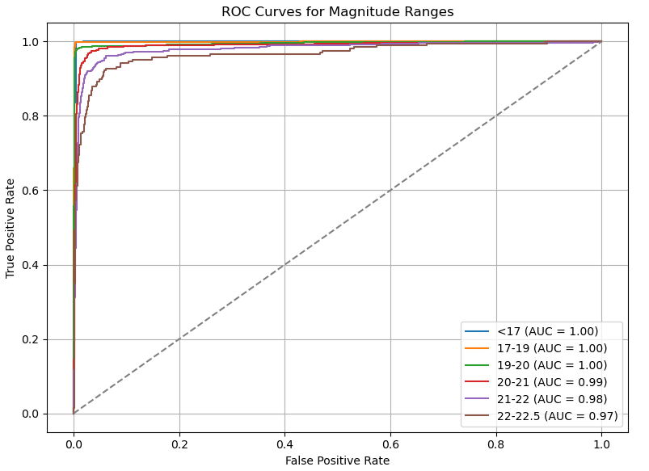
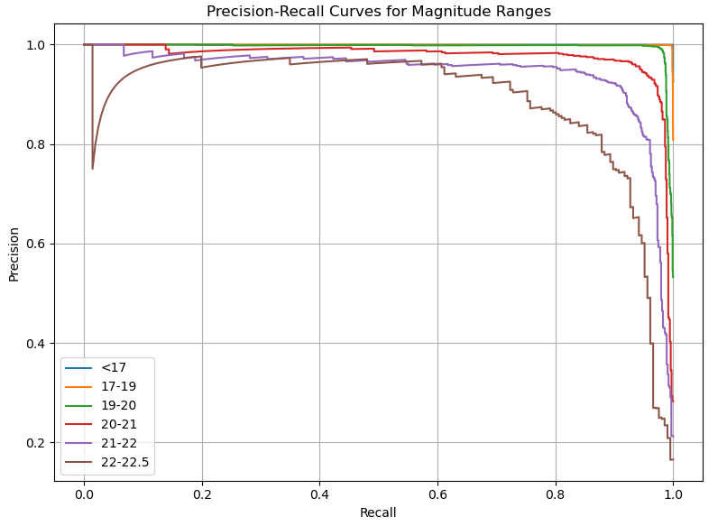

# J-PAS star-galaxy separation via autosklearn

[21 May 2025]

We provide star-galaxy classification, or more precisely a classification of extended (galaxies) vs point-like (stars and quasars) sources, for J-PAS objects in the **IDR202406** dataset that were observed in at least 40 bands (i.e., fewer than 40 bands with `nan` or `0` in flux), with `i < 22.5` and no mask flags in the i-band (`mask_flags = 0`).  

In the resulting **Value-Added Catalog (VAC)**, we provide the predicted class along with the associated probabilities: the likelihood of the source being a star is given in the `prob_star` column, while the likelihood of it being a galaxy or quasar is in the `prob_gal` column. The `label` column indicates the true class of the object:
- `0` → star  
- `1` → galaxy/quasar

Contributors:  
Carlos Augusto Ruviaro de Oliveira <caruviaro@outlook.com>  
Paulo Afrânio <plopes@ov.ufrj.br>  

## Training set

v5 - 14/12/2024 
full features, challenge [training set v5 / test set v5](https://github.com/J-PAS-collaboration/DAVA/tree/master/star-galaxy_classification_challenge)

## Features

- ALPHA_J2000, DELTA_J2000,MAG_AUTO, MAG_ISO, MAG_PETRO, MU_MAX, PETRO_RADIUS, A_WORLD, B_WORLD, MAG_APER_1_5, MAG_APER_3_0, FWHM_WORLD, X_IMAGE, Y_IMAGE, R_EFF, A/B, C, MU_MAX_APER.

## ML model

We use [[**Auto-sklearn**](https://automl.github.io/auto-sklearn/master/)], an automated machine learning framework that performs model selection, hyperparameter optimization, and ensembling. The final model is an **ensemble**, meaning it combines multiple machine learning models to produce more robust and accurate predictions. This approach leverages the strengths of different models to reduce variance and improve generalization.

## Data products

### Performance evaluation

#### Confusion Matrix

<!--  -->

#### ROC curves

#### Precision Recall curves

<!--  -->